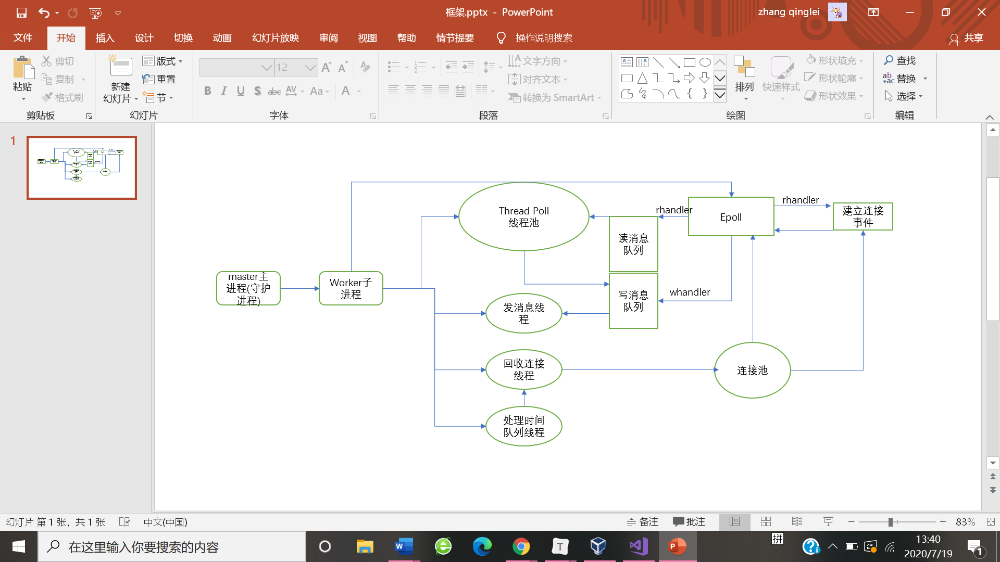

# mkdyd-architecture
本项目是一个支持linux的轻量级通讯服务器。其基于C++11，采用多进程（1个master进程+1个worker进程）+多线程（Thread Pool）的架构方式，epoll(LT)的单reactor多线程模型的多路复用技术，实现了数据包的收发功能。核心技术如下：

```
在worker进程中创建线程池进行业务逻辑的处理。

·采用epoll多路复用技术监听事件提高并发能力。

·约定包头+包体的数据包格式解决粘包问题。
```

### 系统主要架构 


### 未完待续...   
-实现响应http请求  
-提升并发能力

### 一些用得到的linux命令  
vim查找字符串：/keyword

查询进程信息：ps -eo pid,ppid,sid,tty,pgrp,stat,comm,cmd | grep -E 'bash|PID|mkdyd'

内存泄漏检查：valgrind --tool=memcheck --leak-check=full --show-reachable=yes ./mkdyd

修改文件时间属性(若文件不存在创建文件)：touch filename

批量删除文件：rm -rvf filename*

模拟客户端通讯工具：telnet ip port  

查询网络相关信息：netstat -anp | grep -E 'State|port'

向文件添加内容：echo "xxx" > file

查看文件内容：cat file

查看进程下面的线程：ps -T -p <pid>

查看进程占的资源：top -p pid

查看系统的资源：top

查看收发缓冲区大小：cat /proc/sys/net/ipv4/tcp_rmem(tcp_wmem)
